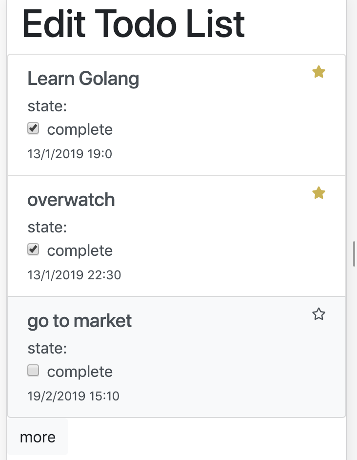

# Line Bot Todo List

https://github.com/muitsfriday/linebot-todos

## QR CODE for Line Bot (add pleaseeee)

## Initiate Line Bot Service (service-message in Go)

### Enviroment variable setup
Your server must provide following enviroment variable
- MONGODB_URI a mongo connection string.
- SECRET linebot's secret.
- TOKEN linebot's token.
- TODOS_COLL todo database table/collction name.
- EDIT_URI url bot use to send when edit command called.
- PORT port that your want to run (no need to set on Heroku).

### Deploy on Heroku
- Create new app.
- See deploy using docker section.
- The command docker `heroku container:push web` and `heroku container:release web` must run on service-message folder.

### Deploy on other
There is a Dockerfile in service-message you can build it with `docker build -t <your_image_name> .` in service-message directory and deploy it anywhere.

### Performance concerning
Please index the mongo todo collection with field
- `userId` Todo List query the todo list from userId. There a lot of performance improve with this index.

sorting index
- `dueDate` the service query order by dueDate asc
- `important` the service has order important task first

### Tests
run command `go test`

---

## Initiate Webview Service (service-web in node.js)

The webview service is seperate into 2 main functions.

#### express web server 
This provide API for list / updates todo list

API list are
- GET `/list?page=1` Get todo list of current user.
- POST `/done` with `taskId` -- the to be updated todo item id -- and `flag` -- specify which item is complete or not -- as param
- POST `/important` Mark task as important or not. This take `taskId` and `flag` too.

All api use jwt token from line login to verify user.

Pages  `/edit` is webview editor of todo list app. This force user to login with line before taking any action on their todo list.

### react app for render frontend

Todo list app front end made from react. See src in servcie-web folder. This bundled with Webpack into dist directory and called by `/edit` page

### Enviroment variable setup

- BASE_URI specify the uri of web service eg. https://aaa.heroku.com/
- LINE_CLIENT_ID Line login client id
- LINE_SECRET Line login client secret
- MONGODB_URI Mongo DB connection string
- TODOS_COLL Collection name use for store todo's document

### Deploy on Heroku
- Create new app.
- See deploy using docker section.
- The command docker `heroku container:push web` and `heroku container:release web` must run on service-web folder.

### Deploy on other
There is a Dockerfile in service-web you can build it with `docker build -t <your_image_name> .` in service-message directory and deploy it anywhere.

### Tests

run `yarn test`
The test useing mocha.

---
## Cron job for sending message
not implement yet :(